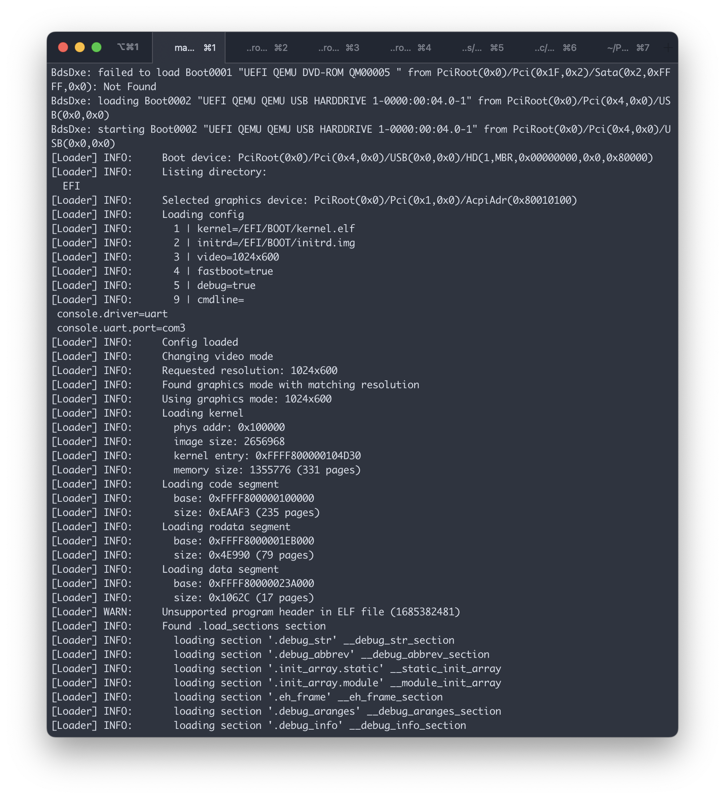
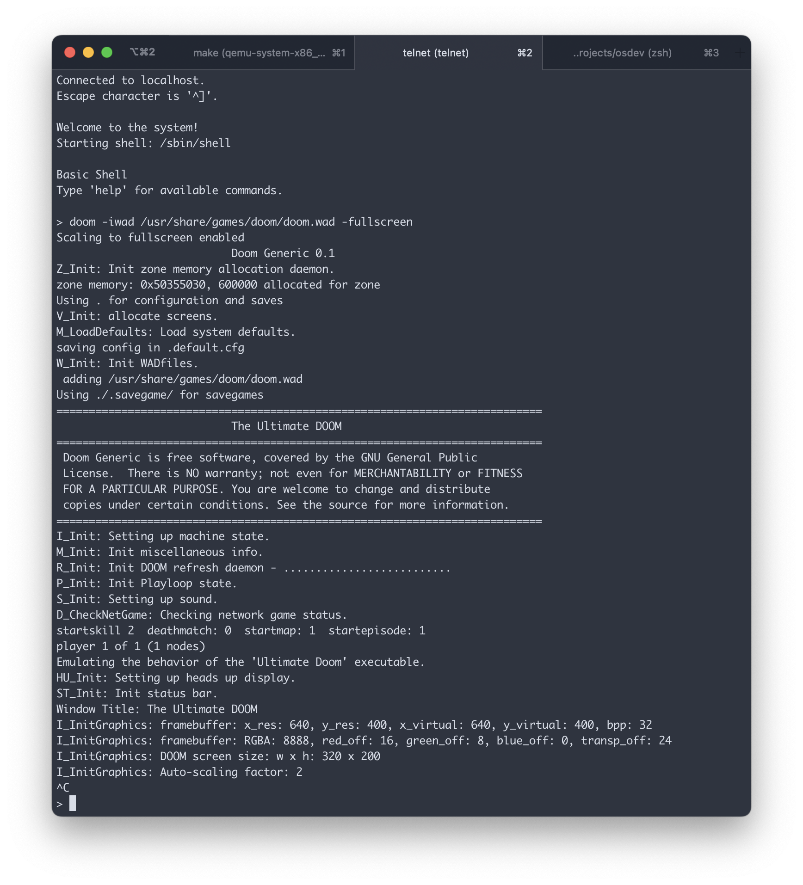

# Hobby Operating System

This is a modern 64-bit UEFI-based UNIX-like hobby operating system. It has been an 
ongoing project for a while, and it serves as a sandbox to learn about operating
system design and other low-level concepts. The goal is to match the Linux syscall
ABI so that we can use the [musl libc](https://musl.libc.org/) for our standard library.
This also means that any third-party software that can be compiled with musl and
the custom toolchain should run on the system. In practice, there are still many
syscalls not implemented and so it is currently expected that many of the programs
will hit a kernel panic. The operating system currently hosts the busybox toolset,
and a couple of other userspace programs. It also now runs DOOM!

# Screenshots


<details>

<summary>More Screenshots</summary>





</details>

# Project Structure

```
├── bin           userspace programs
├── boot          uefi edk2 bootloader
├── drivers       external device drivers
│  └── usb          usb host/device drivers
├── fs            filesystem types
│  ├── devfs        device filesystem driver
│  ├── initrd       initial ramdisk filesystem driver
│  ├── procfs       dynamic information filesystem driver and framework
│  └── ramfs        generic in-memory filesystem driver
├── include       header files
├── kernel        core kernel code
│  ├── acpi         acpi drivers
│  ├── bus          pci & pcie drivers
│  ├── cpu          cpu related code and assembly routines
│  ├── debug        debugging facilities (DWARF, stacktrace, etc)
│  ├── gui          graphics code (not used yet)
│  ├── hw           core system hardware drivers (apic, ioapic, etc)
│  ├── mm           physical and virtual memory management
│  ├── tty          terminal interface
│  ├── usb          usb interface
│  └── vfs          virtual filesystem code
├── lib           kernel data structures, algorithms and other misc. libraries
├── sbin          userspace system programs
├── screenshots   screenshots of the system
├── scripts       build related scripts and support files
├── third-party   third party submodules
├── toolchain     toolchain build files and patches
├── tools         host development tools/plugins
└── usr.bin       userspace programs
```

# Toolchain

To build the full toolchain from source:
```shell
make -C toolchain all -j$(nproc)
```

# Building & Running

To set up a fresh environment and create the various required config files, run:
```shell
make setup
```
To compile the kernel and build a bootable system image, run:
```shell
make all
```
To run the system in QEMU, run:
```shell
make run
```
This will launch QEMU and start a TCP server on port 8008 for the guest's `/dev/ttyS2` serial 
port, which is what the kernel's shell is running on. You can connect to it using telnet:
```shell
telnet 127.0.0.1 8008
```

## Clang-tidy Plugin

This project includes a custom clang-tidy plugin for linting the kernel code. You can find more information
about it in the [plugin README](tools/clang-tidy-plugin/README.md). This plugin will only be built if the 
`CLANG_BUILD_PLUGIN` option is set  to `y` in `.config`.


## QEMU Profiling Plugin

This project includes a custom QEMU plugin for profiling guest execution. You can find more information
about it in the [plugin README](tools/qemu-profile-plugin/README.md). This plugin will only be built if
the `QEMU_BUILD_PLUGIN` option is set to `y` in `.config`. When enabled, two additional Make targets are
available: `run-profile` and `profile-resolve`.
