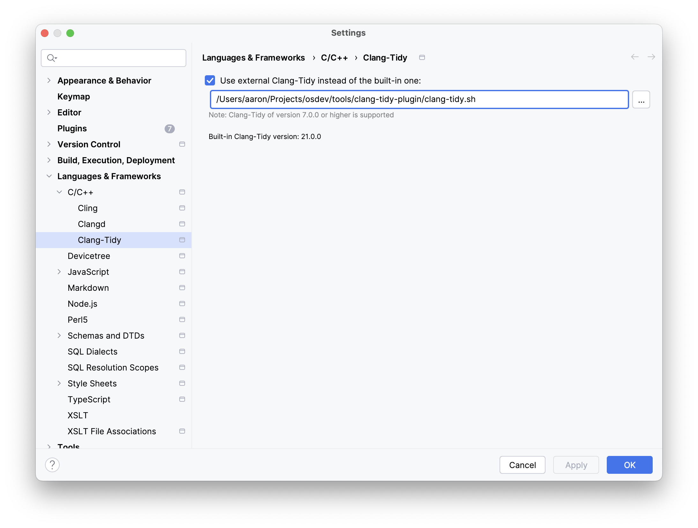

# Clang-Tidy Plugin

A clang-tidy plugin with custom checks for operating system development. Currently the
only check it provides is `osdev-fmt-string`, which checks format strings parsed by the
`fmt` library which includes both printf-style (`%d`) and fmt-style (`{}`) format strings.

## Building

```bash
make
```

Produces `OsdevPlugin.so` in the build directory (under `tools/clang-tidy-plugin`).

## Usage

```bash
clang-tidy -load ./OsdevPlugin.so -checks='-*,osdev-fmt-string' file.c
```

## Configuration

Configure via `.clang-tidy`:

```yaml
Checks: 'osdev-fmt-string'
CheckOptions:
  - key: osdev-fmt-string.Functions
    value: 'kprintf:1:2,ksprintf:2:3,ksnprintf:3:4'
  - key: osdev-fmt-string.CustomTypes
    value: 'err=int,cstr=struct cstr*'
```

## Options

#### `osdev-fmt-string.Functions`

A comma-separated list of functions to check, with the format:

```
FunctionName[:FormatStringArgPosition:FirstVarArgPosition]
```

#### `osdev-fmt-string.CustomTypes`

A comma-separated list of custom types to recognize, with the format:

```
TypeFormat=TypeName
```

Where `TypeFormat` is the format specifier for the type, and `TypeName` is one of:

```
char
uchar
short
ushort
int
uint
long
ulong
longlong
ulonglong
size_t
ssize_t
double
pointer
void*
cstring
struct <name>
struct <name>*
```

These custom types can only be used in fmt-style (`{}`) format strings.

## Format Attribute

Functions with an annotate attribute of `fmt_format:X:Y` are also checked, where `X` is the 1-based 
index of the format string argument and `Y` is the  1-based index of the first variadic argument.

```c
void debug_log(const char *fmt, ...) __attribute__((annotate("fmt_format:1:2")));
```

## Examples

The plugin detects:
- Missing arguments: `kprintf("%d")`
- Extra arguments: `kprintf("hello", 42)`
- Type mismatches: `kprintf("%d", "string")`
- Invalid specifiers: `kprintf("%q", x)`
- Unclosed braces: `kprintf("value: {")`

## Integration with CLion

1. Build the plugin as described above.
2. Open CLion settings/preferences.
3. Navigate to `Languages & Frameworks` > `C/C++` > `Clang-Tidy`.
4. Select `Use custom clang-tidy binary` and set the path to the `clang-tidy.sh` wrapper script.


