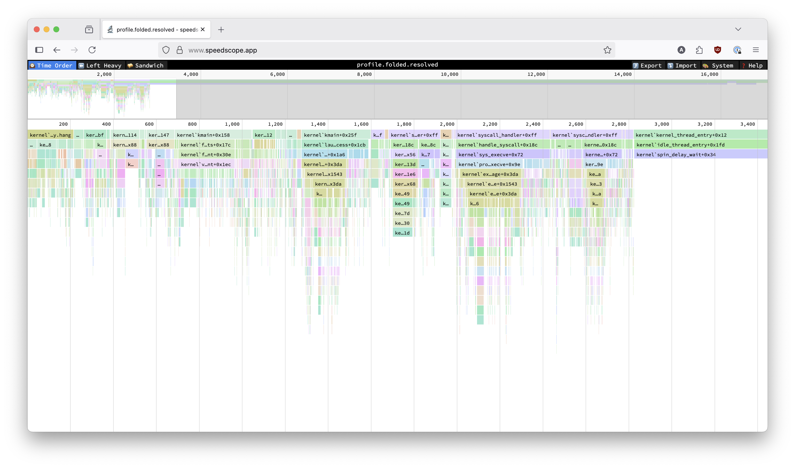

# QEMU Profiling Plugin

A QEMU plugin for profiling guest code execution. It produces a file containing the stack samples
in the "folded stack" format compatible with [FlameGraph](https://github.com/brendangregg/FlameGraph).
This format is also compatible with online interactive flamegraph viewers like [Speedscope](https://www.speedscope.app/).



## Building

To build the plugin, you need to have the QEMU headers installed available. The `QEMU_INCLUDE_DIR` 
environment variable should point to the QEMU include directory which contains the `qemu-plugin.h`
header. Also this plugin requires the `glib-2.0` library to be installed and locatable by `pkg-config`.

Then you can build the plugin with:

```bash
make
```

Which produces a plugin shared object file named `qemu-profile.so` in `$(BUILD_DIR)/tools/qemu-profile-plugin`.

## Usage

```bash
qemu-system-x86_64 -plugin ./path-to/qemu-profile.so[,args] [qemu-options]
```

This produces a profile with raw symbol addresses. To resolve the symbol names, first
create a symbols file for the kernel:
```bash
../../scripts/gen_syms.py -k path/to/kernel.elf -o kernel.syms
```

Then generate a resolved profile using:
```bash
../../scripts/resolve_profile.py profile.folded kernel.syms > profile-resolved.folded 
```

## Options

- `period=N` - Sample every N instructions (default: 10000)
- `output=FILE` - Output file (default: profile) 
- `kernel` - Profile kernel code only
- `user` - Profile user code only
- `depth=N` - Maximum stack depth (default: 64)
- `nosymbols` - Don't add symbol prefixes
- `vcpus=N:M:...` - Profile only specified vCPUs (colon-separated, empty=all)

## Example

```bash
qemu-system-x86_64 -plugin ./qemu-profile.so,period=5000,output=profile.folded,kernel kernel.elf
```
